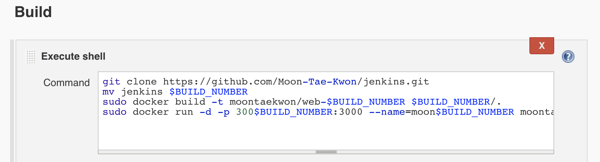
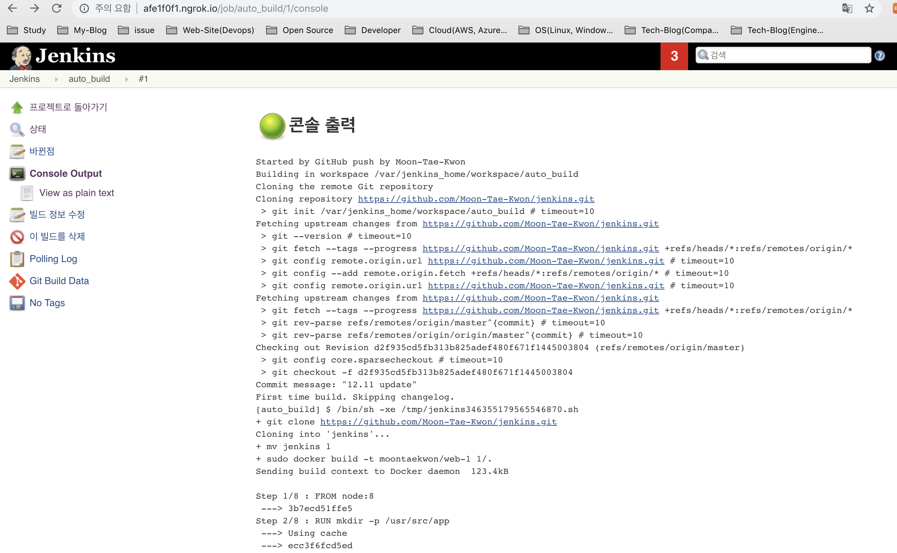

# jenkins를 활용한 docker auto build + github
본 문서는 hands-on에 가까운 문서이며 구체적인 개념 설명은 참조링크를 활용합니다.

## Overview
docker outside fo docker (DooD)를 이용한 docker 안에서 구동되는 jenkins 어플리케이션이 호스트의 docker 명령어를 이용하여 자동 build 하는 과정을 테스트한 내용 입니다.

---
### reference link
- [jenkins](https://github.com/jenkinsci/jenkins)
- [node wiki](https://en.wikipedia.org/wiki/Node.js)
- [github-webhooks](https://developer.github.com/webhooks/)
- [ngrok](https://ngrok.com/)
- [sparse checkout](http://stackoverflow.com/questions/600079/is-there-any-way-to-clone-a-git-repositorys-sub-directory-only)

상세설명이 필요한 내용은 테스트 순서에 맞게 추가 기재 하였습니다 그 밖의 내용의 경우는 아래의 사전 설명및 위의 링크를 확인하여 주시기 바랍니다.
(docker 설치완료 및 [docker_paas](https://github.com/dev-chulbuji/DevOps_Seongnam/tree/master/docker_paas) 내용을 숙지 했다고 생각하고 진행 합니다.)
* jenkins - Continuous Integration(지속적 통합) & Continuous Deliver(지속적 전달)용도로 많이 사용되고 있는 툴중 하나 입니다.
* ngrok - localhost를 공용IP로 변환해주는 툴중 하나 입니다.

--- 
dockerhub download [moontaekwon/dood-jenkins](https://hub.docker.com/r/moontaekwon/dood-jenkins/)
```
docker run -d -v /var/run/docker.sock:/var/run/docker.sock -v $(which docker):/usr/bin/docker -p 8080:8080 moontaekwon/dood-jenkins:1.0
```
docker build를 할 경우에는 아래의 소스코드를 이용 해주시면 됩니다. (아래의 파일 다운받은 이후 docker build 및 docker run)
- [Dockerfile](https://github.com/dev-chulbuji/DevOps_Seongnam/blob/master/docker_auto_build_jenkins/Dockerfile)
- [pulgins.txt](https://github.com/dev-chulbuji/DevOps_Seongnam/blob/master/docker_auto_build_jenkins/plugins.txt)
```
docker build -t moontaekwon/dood-jenkins .
docker run -d -v /var/run/docker.sock:/var/run/docker.sock -v $(which docker):/usr/bin/docker -p 8080:8080 moontaekwon/dood-jenkins
```
확인.


ngrok 설치 8080포트 공인DNS로 변환.
```
./ngrok http 8080 # 설치 경로에서 진행.
```

jenkins 설정
```
docker exec -it $CONTAINER-NAME bash
cat /var/jenkins_home/secrets/initialAdminPassword
exit
```
install suggested plugins / 이후 계정 설정

이번 테스트에서 github와 연동을 github plugin 확인

jenkins item 설정


project url 지정 (github 주소)

소스코드 관리 (github *.git 주소 입력)

빌드 유발

빌드
* docker 명령어 과정에서 sudo 명령어 사용 및 빌드넘버로 변수를 사용.
```
git clone https://github.com/Moon-Tae-Kwon/jenkins.git
mv jenkins $BUILD_NUMBER
sudo docker build -t moontaekwon/web-$BUILD_NUMBER $BUILD_NUMBER/.
sudo docker run -d -p 300$BUILD_NUMBER:3000 --name=moon$BUILD_NUMBER moontaekwon/web-$BUILD_NUMBER
```


---
github webhooks

jenkins 에서 등록한 소스코드 github 주소로 이동하여 별도 생성한 repositories 접속한이후 Settings 이동 및 webhooks 설정
* ngrok 에서 설정했던 jenkins 주소 등록 및 /github-webhook/ 추가 설정


확인 (외부 Root DNS에 등록되기 까지 5~10분 정도의 시간이 소유될수 있습니다.)


---
소스코드 push

node.js기반의 간단한 "hello" 웹사이트를 dockerfile로 재작하여 웹사이트의 내용을 변경한 이후 push 하였을 경우 auto_build 동작여부 확인.

server.js 내용을 변경하여 dockerfile 자체를 build 하고 최초 확인.
```
docker build -t moontaekwon/web .
docker run 
```


server.js 내용 변경 && 변경 내용 push


* 위의 node.js 기반의 간단한 dockerfile이 필요할 경우
```
git clone https://github.com/Moon-Tae-Kwon/jenkins.git
```

---

jenkins build 확인.



build execute sheel 내용 확인


모든 테스트가 마무리 되었습니다. 위와 같은 방법으로 docker 서버와 jenkins 서버의 분리없이 사용이 가능하며 그 밖의 Blue-Green 배포 등의 많은 기능등이 스크립트 제작 및 jnekins의 플러그인 적용등으로 가능 합니다.